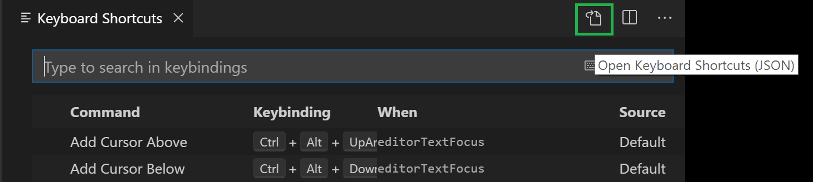
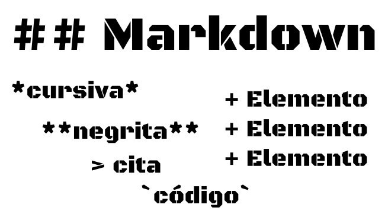

# Visual Studio Code - Axional


## Extensiones
+ **Auto Rename Tag**: Autorenombra el nombre del elemento al principio y al final de la etiqueta en HTML/XML
+ **Bracket Pair Colorizer**: Colorea el par de corchetes, llaves, etc según son anidados
+ **Comment Translate**: Traduce los comentarios a un idioma especificado
+ **ESLint**: Analiza y muestra errores de sintaxis en Javascript
+ **Git History**: Muestra la linea de tiempo de los commits realizados en un repositorio y las diferentes opciones sobre esta
+ **XML Tools**: Autocompleta las etiquetas de elementos XML

## Extensiones complementarias
+ **Spanish Languaje Pack for Visual Studio Code**: Cambia el idioma de Visual Studio Code
+ **Material Icon Theme**: Aplica un tema atractivo a los iconos de los ficheros
+ **GitLens**: Muestra información de los commits realizados directamente en el código
+ **Live Share**: Permite la colaboración remota

***
## Settings en un repositorio
Añade líneas de guía. Por ejemplo, para crear dos líneas guía a 80 y 160 caracteres y con un color determinado, debe crear la carpeta ./vscode en la carpeta de trabajo y dentro de esta, el fichero **settings.json** con el siguiente código:

```json
{
    "commentTranslate.targetLanguage": "es",
    "editor.rulers": [80,160],
    "workbench.colorCustomizations": {
        "editorRuler.foreground": "#646464"
    }
}
```
[Settings VSCode](.vscode/settings.json)

***
## Snippets
Configure el uso de snippets para diferentes lenguajes, por ejemplo
### Javascript
[Snippets JS](snippets/javascript.json)

### XML
[Snippets XML](snippets/xml.json)

***
## Keybindings
Configure el uso de Keybindings (métodos abreviados de teclado) en modo **unix** (configuración
personalizada para lograr la misma combinación en Linux/Windows/Mac)


[Keybindings UNIX](keybindings/unix.keybindings.json)

***
# Sintaxis Marckdown
### Imagen marckdown


### URL Marckdown
[Sintaxis Marckdown](https://markdown.es/sintaxis-markdown/)

[Sintaxis Marckdown](https://markdown.es/sintaxis-markdown/, "Título alternativo")


***
# Git


## Comandos git
+ **git config --list**: Configuración actual
+ **git config --global user.name "Nombre Apellido"**: Configura el nombre
+ **git config --global user.email nombre@mail.com**: Configura el correo
+ **git init**: Inicializa un repositorio git
+ **git status**: Muestra el status de los ficheros

+ **git add file.ext**: Añade el archivo pendiente file.ext al espacio "staged" para poder pasarlo mediante commit
+ **git add .**: Añade todos los archivos pendientes al espacio "staged" ara poder pasarlo mediante commit
+ **git commit -m "*notacion(codigo de tarea): descripcion*"**: Añade el commit para todos los archivos del "staged"
    ~~~
    git commit -m "feat(TEST-001): Creación de nueva función"
    ~~~
+ **git commit -am "*notacion(codigo de tarea): descripcion*"**: Añade el commit para todos los archivos "MODIFICADOS" sin necesidad de un *git add*
    ~~~
    git commit -am "feat(TEST-001): Creación de nueva función"
    ~~~
+ **git log**: Lista todos los commits. Presionar la tecla **q** para salir del log
+ **git log --oneline**: Lista todos los commits de forma resumida. Presionar la tecla **q** para salir del log

+ **git checkout master**: Cambia a la rama "master"
+ **git checkout develop**: Cambia a la rama "develop" (Rama principal de desarrollo)
+ **git branch**: Lista de ramas
+ **git reset --soft HEAD~1**: (Sin enviar a repositorio remoto) HEAD~1 [Retrocede a la versión inmediatamente anterior a la que estamos ahora] --soft [manteniendo los cambios]
+ **git reset --hard HEAD~1**: (Sin enviar a repositorio remoto) HEAD~1 [Retrocede a la versión inmediatamente anterior a la que estamos ahora] --hard [eliminando los cambios]


## Comandos git - repositorios remotos

+ **git clone {urlDelOrigen}**: Clona un repositorio remoto a un espacio local
    ~~~
    HTTPS
    git clone https://direccion.git

    SSH
    git clone git@dominio.com:USERNAME/REPOSITORY.git
    ~~~
+ **git remote -v**: Muestra la lista de conexiones de repositorios locales con la nube (fetch/pull: importa/descarga | push: exporta/incorpora)
+ **git remote add {nombreDelWorkspace} {urlDelOrigen}**: Añade las conexiones remotas con el nombre "{nombreDelWorkspace}". Al hacer clone, por defecto se añade con el {nombreDelWorkspace}=origin
    >Cuando se añade una conexión remota principal, el {nombreDelWorkspace} a emplearse (como convención) es **upstream**.
    ~~~
    git remote add upstream https://direccion_principal.git
    ~~~
+ **git remote remove {nombreDelWorkspace}**: Elimina las conexion con el mismo {nombreDelWorkspace}, por defecto: {nombreDelWorkspace}=origin
+ **git pull {nombreDelWorkspace} {nombreDeLaRama}**: Importa todos los cambios desde el reporsitorio remoto
    ~~~
    git pull origin develop
    ~~~
+ **git push {nombreDelWorkspace} {nombreDeLaRama}**: Añade los cambios al repositorio remoto, siempre después de un pull para evitar conflictos.
    ~~~
    git push origin develop
    ~~~
+ **git remote set-url {nombreDelWorkspace} {urlDelOrigen}**: Actualiza la dirección URL remota, por ejemplo, de HTTPS a SSH, viceversa u otra dirección. 
    ~~~
    git remote set-url origin git@dominio.com:USERNAME/REPOSITORY.git
    ~~~
+ **git stash**: Almacena temporalmente los cambios que se haya realizado en el código
+ **git stash pop**: Aplica los cambios almacenados temporalmente

## Git-flow
[Git-flow diagram](http://danielkummer.github.io/git-flow-cheatsheet/)

+ **git flow init**: (Requiere instalación de git-flow) Inicializa el flujo de trabajo

### Notación (prefijos) para comentarios de acuerdo a Git-flow
+ **feat**: Una nueva característica
+ **fix**: Una corrección de error
+ **docs**: Cambios en la documentación o en los comentarios(notar que el tipo es en plural 'docs')
+ **style**: Cambios que no afectan el significado del código (espacios en blanco,  formateo, faltó un punto y coma, etc)
+ **refactor**: Un cambio en el código que no corrige un error, ni agrega una  característica
+ **test**: Agregando pruebas que falten(porque agregar nuevos test son considerados feat)
+ **perf**: Cambio de código que mejora el rendimiento
+ **revert**: rollback del commit 5050sad_istic
+ **chore**: Cambios en el proceso de construcción(compilación) o herramientas auxiliares y/o bibliotecas como generadores de documentación
+ **import**: Importación de ficheros desde otra biblioteca